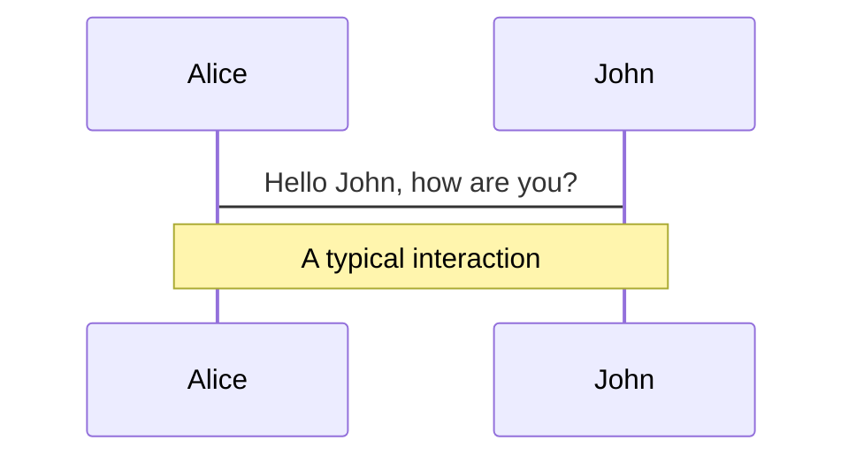
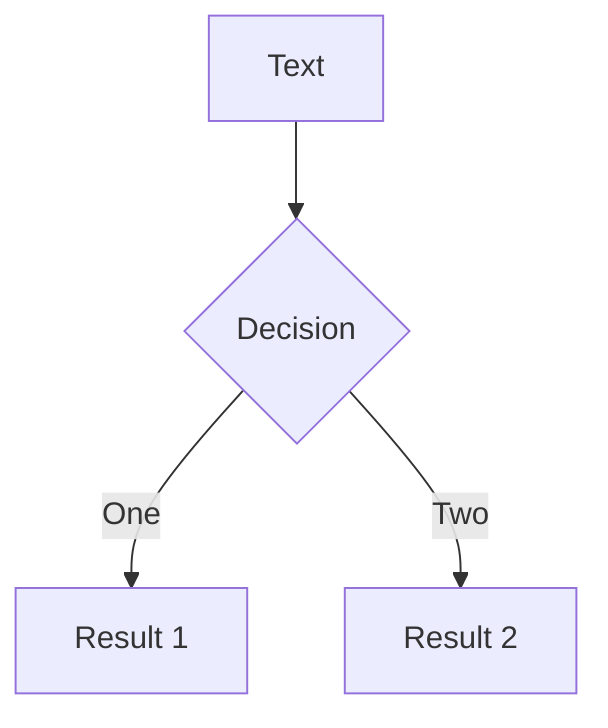
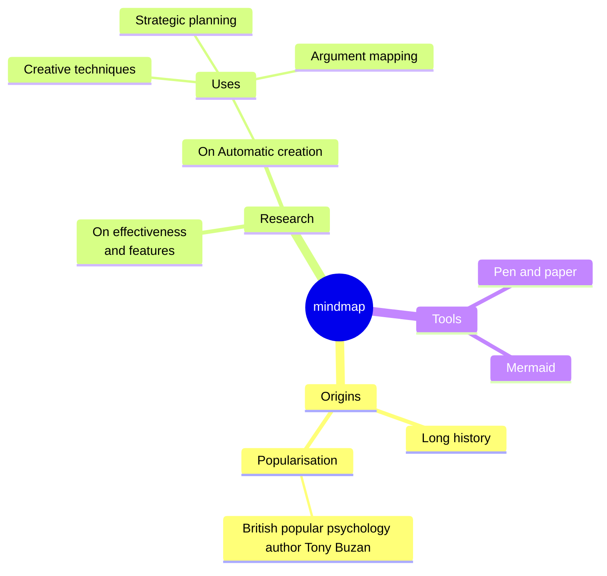
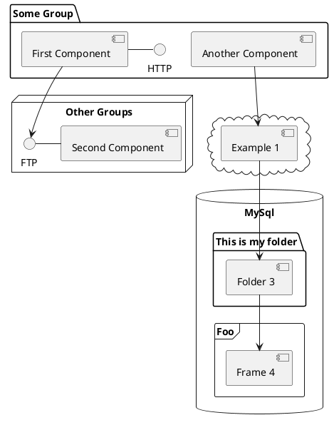

---
# You can also start simply with 'default'
theme: seriph
# random image from a curated Unsplash collection by Anthony
# like them? see https://unsplash.com/collections/94734566/slidev
background: https://cover.sli.dev
# some information about your slides (markdown enabled)
title: Welcome to Slidev
info: |
  ## Slidev Starter Template
  Presentation slides for developers.

  Learn more at [Sli.dev](https://sli.dev)
# apply unocss classes to the current slide
class: text-center
# https://sli.dev/features/drawing
drawings:
  persist: false
# slide transition: https://sli.dev/guide/animations.html#slide-transitions
transition: slide-left
# enable MDC Syntax: https://sli.dev/features/mdc
mdc: true
# open graph
# seoMeta:
#  ogImage: https://cover.sli.dev
---

# Bug案例原因分享

<div class="abs-br m-6 text-xl">
  <a href="http://yzc.test/" target="_blank" class="slidev-icon-btn">
    <icon-park-outline:link-one />
  </a>
</div>

---
transition: fade-out
---

# 先来看一下这个Bug的表现

[Bug链接](http://yzc.test)

<v-click>

主要表现为以下现象

</v-click>

<v-clicks>

- 切换了类型后，红色报错提示的样式转移到了另一个元素的位置。反复切换类型后，红色报错提示的样式的位置来回变化
- 表单的校验方法失效

</v-clicks>

<!-- <style>

.slidev-vclick-target {
  transition: all 500ms ease;
}

.slidev-vclick-hidden {
  transform: scale(0);
}
</style> -->

---
---

知道了这个bug有哪些表现，我们可以根据现象一条条分析

# 切换了类型后，红色报错提示的样式转移到了另一个元素的位置。反复切换类型后，红色报错提示的样式的位置来回变化

这个问题的重点是某个元素的**位置**发生了变化。

<v-clicks>

- 如果是在使用jQuery的项目中产生这种问题，解决起来就会非常清晰。因为每个dom元素的位置和顺序等都是由用户自己手动操作实现，只需要查看每个dom操作步骤即可发现是哪一步产生了错误。
- 而在vue中则不同，大家可以回忆一下，除去自己手动去操作dom元素顺序的情况，一般来说，元素的位置顺序发生变化的原因是什么？

</v-clicks>

---
src: ./pages/Imperative.md
---
---
src: ./pages/Declarative.md
---
---
src: ./pages/Compare.md
---

---

通过声明式和命令式框架的对比我们可以发现，声明式框架对比起命令式框架中对于dom的操作已经由显式转为隐式，在使用时无需手动处理dom，由框架接管了这个部分。

对应到vue中，就是我们熟悉的基于vnode这个概念构建的渲染机制，即运行时渲染器遍历dom树，根据dom树的数量决定是挂载(`mount`)还是更新(`patch`)，使用者不需要手动去执行对应的dom操作，具体的dom操作交给vue的渲染器去处理。


具体的dom操作发生的时机是在这张渲染流程示意图中的`patch`部分，所以我们需要去了解一下`patch`过程中具体是如何影响到元素的变化的

---
layout: two-cols
layoutClass: gap-16
---


::right::

观察`patch`的过程可以发现，修补vnode的过程实际是在`patchVnode`方法中，且在`updateChildren`处理之前都是真实元素的复用和属性处理，真正涉及到真实元素顺序变化的地方只有`updateChildren`方法，所以只需要查看`updateChildren`的内部工作原理即可找出该bug影响元素位置的原因。

---

`updateChildren`方法即大家非常熟悉的双端对比diff法，简单来说就是按照一定的对比顺序对比新旧vnode的子节点列表，尽可能找出可以复用的vnode进行patch的过程。

概括起来就是

<v-clicks>

1. 头头比较
2. 尾尾比较
3. 旧头与新尾比较（位置移动）
4. 旧尾与新头比较（位置移动）
5. 构建`key`和`index`的map对象，根据新头的key去查找是否有可`patch`的节点（位置移动）
6. 没有可`patch`节点，新建真实元素

</v-clicks>

所以此时需要观察选项切换前后的vnode列表的`patch`过程，看看是否存在上述几种有位置移动的diff场景存在。

---

### 查看选项切换前后vnode列表

```ts {monaco-diff}
// 空白占位vnode的isComment属性为true
const vnode = [
  { tag: "div", isComment: false, key: undefined, text: undefined, data: { staticClass: "w-40%" },children:'el-select1' },
  { tag: undefined, isComment: false, key: undefined, text: " ", data: undefined },
  { tag: "div", isComment: false, key: undefined, text: undefined, data: { staticClass: "w-20%" },children:'el-select2' },
  { tag: undefined, isComment: false, key: undefined, text: " ", data: undefined },
  { tag: "div", isComment: false, key: undefined, text: undefined, data: { staticClass: "w-40%" },children:'el-select3' },
  { tag: undefined, isComment: false, key: undefined, text: " ", data: undefined },
  { tag: undefined, isComment: true, key: undefined, text: "", data: undefined },
  { tag: undefined, isComment: false, key: undefined, text: " ", data: undefined },
  { tag: undefined, isComment: true, key: undefined, text: "", data: undefined },
  { tag: undefined, isComment: false, key: undefined, text: " ", data: undefined },
  { tag: undefined, isComment: true, key: undefined, text: "", data: undefined },
  { tag: undefined, isComment: false, key: undefined, text: " ", data: undefined },
  { tag: undefined, isComment: true, key: undefined, text: "", data: undefined },
];
~~~
// 空白占位vnode的isComment属性为true
const vnode = [
  { tag: "div", isComment: false, key: undefined, text: undefined, data: { staticClass: "w-40%" },children:'el-select1' },
  { tag: undefined, isComment: false, key: undefined, text: " ", data: undefined },
  { tag: undefined, isComment: true, key: undefined, text: "", data: undefined },
  { tag: undefined, isComment: false, key: undefined, text: " ", data: undefined },
  { tag: "div", isComment: false, key: undefined, text: undefined, data: { staticClass: "w-20%" },children:'el-select3' },
  { tag: undefined, isComment: false, key: undefined, text: " ", data: undefined },
  { tag: "div", isComment: false, key: undefined, text: undefined, data: { staticClass: "w-40%" },children:'el-select2' },
  { tag: undefined, isComment: false, key: undefined, text: " ", data: undefined },
  { tag: undefined, isComment: true, key: undefined, text: "", data: undefined },
  { tag: undefined, isComment: false, key: undefined, text: " ", data: undefined },
  { tag: undefined, isComment: true, key: undefined, text: "", data: undefined },
  { tag: undefined, isComment: false, key: undefined, text: " ", data: undefined },
  { tag: undefined, isComment: true, key: undefined, text: "", data: undefined },
];
```

根据刚才的双端对比法，我们可以发现在排除了头部和尾部直接可以`patch`的vnode节点后，旧vnode列表的头部和新vnode列表的尾部的vnode可以进行`patch`，这意味着这个被复用的节点位置发生了变化，也就解释了为什么出现了这个元素位置反复变化的现象，其实就是简单的vnode复用的问题。

既然知道了原因，那么解决方法就很容易想到了，比如我们可以不让这个节点进行复用，即在patch阶段不让其视为同一类节点。最简单的方法就是自然是给vnode添加自定义的`key`，`key`不同自然也就无法进行修补，只能新增对应的节点。这样也就不存在复用过程中dom顺序变化的问题了。

那么还有其他更简单合理的方案吗

观察两组列表，可以发现其中有非常多的注释类型的vnode，这里我们排除掉那些不会影响`patch`时vnode顺序的节点便于观察

```ts {monaco-diff}
// 空白占位vnode的isComment属性为true
const vnode = [
  { tag: "div", isComment: false, key: undefined, text: undefined, data: { staticClass: "w-20%" },children:'el-select2' },
  { tag: undefined, isComment: false, key: undefined, text: " ", data: undefined },
  { tag: "div", isComment: false, key: undefined, text: undefined, data: { staticClass: "w-40%" },children:'el-select3' },
  { tag: undefined, isComment: false, key: undefined, text: " ", data: undefined },
  { tag: undefined, isComment: true, key: undefined, text: "", data: undefined },
];
~~~
// 空白占位vnode的isComment属性为true
const vnode = [
  { tag: undefined, isComment: true, key: undefined, text: "", data: undefined },
  { tag: undefined, isComment: false, key: undefined, text: " ", data: undefined },
  { tag: "div", isComment: false, key: undefined, text: undefined, data: { staticClass: "w-20%" },children:'el-select3' },
  { tag: undefined, isComment: false, key: undefined, text: " ", data: undefined },
  { tag: "div", isComment: false, key: undefined, text: undefined, data: { staticClass: "w-40%" },children:'el-select2' },
];
```

可以看到正是这些注释类型的vnode导致了`patch`过程中位置的变化，因为头部尾部都不再能够直接修补，如果没有这些注释节点，`patch`的时候顺序就不会变化了

---

那么还有一个问题，为什么会出现这样的vnode列表呢？`v-if`我们平时用的很多，不管是简单的渲染两种不同dom的情况还是超过两种的情况一般都不会遇到这个问题，为什么这里会有这样的问题呢

我们来看一个简化版的demo

---
layout: iframe
url: http://localhost:5175
---

---

可以看到简化的demo有着同样的问题，切换前后渲染的dom位置不停变化，现象相同，所以我们可以通过看这个简化组件的渲染函数来解决上面的问题

<div v-click="1">

```javascript {4-17|all}
function render() {
  var _vm = this, _c = _vm._self._c, _setup = _vm._self._setupProxy;
  return _c("div", { staticClass: "demo" }, [
    _setup.boolean 
    ? [
      _c("div", { ref: "div1", staticStyle: { "color": "orange" } },
       [_vm._v(" \u6211\u662F\u76F4\u7684 ")]),
        _c("div", { staticStyle: { "color": "red" } },
         [_vm._v(" \u6211\u662F\u7EA2\u8272 ")])] 
         : _vm._e(), 
         !_setup.boolean 
         ? [
          _c("div", { staticStyle: { "color": "blue" } },
           [_vm._v(" \u6211\u662F\u84DD\u8272 ")]),
            _c("div", { ref: "div4", staticStyle: { "color": "green" } },
             [_vm._v(" \u6211\u662F\u7626\u7684 ")])]
          : _vm._e()], 2);
}
```

</div v-click>

需要重点关注的是渲染函数中`_setup.boolean`这个判断条件后面的渲染内容，可以看到两个判断条件对应了两个三元运算表达式，而表达式的结果中除了正常的`v-if`条件渲染的内容，都包含`_vm.e()`这个方法调用的结果。

---

在vue2中，渲染函数中所使用的`helper`辅助函数都通过别名挂在到`_vm`实例中，例如此处的`_v`和`_e`方法，挂载的方法如下

```ts
export function installRenderHelpers(target: any) {
  target._o = markOnce
  target._n = toNumber
  target._s = toString
  target._l = renderList
  target._t = renderSlot
  target._q = looseEqual
  target._i = looseIndexOf
  target._m = renderStatic
  target._f = resolveFilter
  target._k = checkKeyCodes
  target._b = bindObjectProps
  target._v = createTextVNode
  target._e = createEmptyVNode
  target._u = resolveScopedSlots
  target._g = bindObjectListeners
  target._d = bindDynamicKeys
  target._p = prependModifier
}
```

找到`_v`和`_e`对应的方法，可以看到分别是`createTextVNode`和`createEmptyVNode`的方法别名。很容易从函数名看出一个是创建文本vnode，一个是创建空的vnode。

也就是说，上面的渲染函数中`_setup.boolean`部分对应的`v-if`的编译结果是，条件结果为真时正常渲染结果，为否时渲染空的注释节点，这也就是为什么上面的vnode列表中有很多空节点，因为同时只会有一个表达式为true，所以始终会有一个三元表达式的结果是一个空的注释节点

所以既然`v-if`的渲染存在空注释节点的问题，我们需要去查看渲染函数的生成，看看`v-if`的模板是如何编译成这样的渲染函数的

---
layout: two-cols
layoutClass: gap-16
---

```ts
// src\compiler\parser\index.ts
// parser阶段

// 记录下模板定义的v-if判断条件
function addIfCondition(el: ASTElement, condition: ASTIfCondition) {
  if (!el.ifConditions) {
    el.ifConditions = []
  }
  // 保存在ifConditions字段中
  el.ifConditions.push(condition)
}

function processIf(el) {
  // 获取指定attribute的值
  const exp = getAndRemoveAttr(el, 'v-if')
  if (exp) {
    el.if = exp
    // 记录v-if表达式
    addIfCondition(el, {
      exp: exp,
      block: el
    })
  } else {
    if (getAndRemoveAttr(el, 'v-else') != null) {
      el.else = true
    }
    const elseif = getAndRemoveAttr(el, 'v-else-if')
    if (elseif) {
      el.elseif = elseif
    }
  }
}
```

::right::

```ts
// src\compiler\codegen\index.ts
// generatecode阶段

function genIf(
  el: any,
  state: CodegenState,
  altGen?: Function,
  altEmpty?: string
): string {
  el.ifProcessed = true // avoid recursion
  return genIfConditions(el.ifConditions.slice(), state, altGen, altEmpty)
}

function genIfConditions(
  conditions: ASTIfConditions,
  state: CodegenState,
  altGen?: Function,
  altEmpty?: string
): string {
  if (!conditions.length) {
    // 没有条件了 生成空的注释节点
    return altEmpty || '_e()'
  }

  // 从记录的ifConditions头部取出条件表达式
  const condition = conditions.shift()!
  if (condition.exp) {
    // 生成三元表达式
    return `(${condition.exp})?${genTernaryExp(
      condition.block
    )}:${genIfConditions(conditions, state, altGen, altEmpty)}`
  } else {
    return `${genTernaryExp(condition.block)}`
  }
}
```

可以看到单独的`v-if`由于只有一个条件，在第二次调用`genIfConditions`的时候条件已经为空了，所以生成了空节点，那么如果只要这时候条件不为空，就可以避免影响`patch`的注释节点产生

这时候我们再看项目中代码

```vue
<!-- 多选下拉 -->
<template v-if="item.input_type === 'select_multi'">
  <div class="w-20%">
  </div>
  <div class="w-40%">
  </div>
</template>
<!-- 单选 -->
<template v-if="item.input_type === 'select_single'">
  <template v-if="item.type === 'boolean'">
    <div class="w-20%">
    </div>
    <div class="w-40%" />
  </template>
  <template v-else>
    <div class="w-20%">
    </div>
    <div class="w-40%">
    </div>
  </template>
</template>
<!-- 主营品类 -->
<template v-if="item.input_type === 'select_category'">
  <div class="w-20%">
  </div>
  <div class="w-40%">
  </div>
</template>
<!-- 输入框 区间 -->
<template v-if="item.input_type === 'int_range' || item.input_type === 'float_range'">
  <div class="w-40%">
    <div class=" mr-12px flex items-center">
    </div>
  </div>
  <div class="w-20%" />
</template>
```

可以看到每个`template`部分其实都是渲染同一个地方，且`v-if`条件其实本身就存在互斥的关系，因此此处应该在第一个`v-if`之后改为使用`v-else-if`进行判断，这样写的作用是会把后续的判断条件放到`ifConditions`数组中，在生成渲染函数的时候便不会直接去生成多个单独的包含空注释节点的三元表达式，而是放在一个嵌套的三元表达式中

还是用刚才的简单的demo举例，改为`v-else-if`后，生成的渲染函数变为

```javascript
function render() {
  var _vm = this, _c = _vm._self._c, _setup = _vm._self._setupProxy;
  return _c("div", { staticClass: "demo" }, 
    [_setup.boolean 
      ? [_c("div", { ref: "div1", staticStyle: { "color": "orange" } }, [_vm._v(" \u6211\u662F\u76F4\u7684 ")]), _c("div", { staticStyle: { "color": "red" } }, [_vm._v(" \u6211\u662F\u7EA2\u8272 ")])] 
      : _setup.boolean === false
       ? [_c("div", { staticStyle: { "color": "blue" } }, [_vm._v(" \u6211\u662F\u84DD\u8272 ")]), _c("div", { ref: "div4", staticStyle: { "color": "green" } }, [_vm._v(" \u6211\u662F\u7626\u7684 ")])]
       : _vm._e()], 2);
}
```

可以看到两处`_setup.boolean`的判断条件都并到了一个三元表达式中，这样在条件发生切换时，都只会影响一条三元表达式的值，而不会出现多余的注释空节点影响`patch`的结果。

同样的，我们把出问题的代码中多的`v-if`改为`v-else-if`，问题也同样解决了

---

# 表单的校验方法失效

知道了第一个问题的原因，了解了`vue`复用节点的过程，第二个问题就比较简单了

表单的校验是通过`element-ui`的`form`组件实现的，调用`form`组件的`validate`方法，触发校验流程，返回校验结果。既然漏校验了一个方法，我们只要去看`element-ui`的`form`组件的`validate`方法源码即可。


---


原因找到了，之后的问题就好解决了，

这就需要去看一下这个组件的渲染函数了，其实也就是看代码的`template`部分的模板代码部分

这个问题的现象是某个下拉框组件元素对应的真实dom的位置发生了变化，且组件本身还带着之前的红色报错提示的样式，所以简化这个问题其实就是在重新渲染后，元素的位置并没有正确的渲染。

所以可以大致分析出问题的原因应该出在vue的patch阶段，即对比了新旧vnode树的时候错误的调整了元素的位置。

第一个下拉框中选择了某些其他类型后，影响了后面的选项的渲染，红色报错提示位置改变。


例如：<Link to="4">删除项错乱的Demo</Link>

---
layout: iframe
url: http://localhost:5175
---

---
layout: two-cols
layoutClass: gap-16
---

# 先简单回顾一下vue2中重新渲染的流程。


<v-click>

### 主要流程为：

</v-click>

<v-clicks>

1. 给变量添加上响应式功能
2. 构建渲染函数watcher，在根据渲染函数生成vnode树的过程中（render）建立变量和渲染函数的依赖关系
3. vnode在patch的过程中生成真实dom
4. 变量值的更新导致重新执行渲染函数生成新的vnode（re-render），在新vnode和旧vnode的patch过程中修改原dom对象

</v-clicks>

---
---

# 再看一下patch单个vnode的过程


---
---

原因：删除数组中的一项后，新旧vnode列表的数量不一致，由于每个vnode的key使用的是数组的index值，导致新vnode列表的key和旧vnode列表的key是相同的，在patch的过程中，头部vnode始终可以被复用。

```ts {monaco-diff}
const vnode = [
    { tag: 'li', isComment: false, text: 'undefined', data: { key: 0 }, children: 0 },
    { tag: 'li', isComment: false, text: 'undefined', data: { key: 1 }, children: 1 },
    { tag: 'li', isComment: false, text: 'undefined', data: { key: 2 }, children: 2 },
    { tag: 'li', isComment: false, text: 'undefined', data: { key: 3 }, children: 3 },
    { tag: 'li', isComment: false, text: 'undefined', data: { key: 4 }, children: 4 },
    { tag: 'li', isComment: false, text: 'undefined', data: { key: 5 }, children: 5 },
    { tag: 'li', isComment: false, text: 'undefined', data: { key: 6 }, children: 6 },
    { tag: 'li', isComment: false, text: 'undefined', data: { key: 7 }, children: 7 },
    { tag: 'li', isComment: false, text: 'undefined', data: { key: 8 }, children: 8 },
    { tag: 'li', isComment: false, text: 'undefined', data: { key: 9 }, children: 9 },
  ];
~~~
const vnode = [
    { tag: 'li', isComment: false, text: 'undefined', data: { key: 0 }, children: 0 },
    { tag: 'li', isComment: false, text: 'undefined', data: { key: 1 }, children: 1 },
    { tag: 'li', isComment: false, text: 'undefined', data: { key: 2 }, children: 2 },
    { tag: 'li', isComment: false, text: 'undefined', data: { key: 3 }, children: 3 },
    { tag: 'li', isComment: false, text: 'undefined', data: { key: 4 }, children: 4 },
    { tag: 'li', isComment: false, text: 'undefined', data: { key: 5 }, children: 5 },
    { tag: 'li', isComment: false, text: 'undefined', data: { key: 6 }, children: 6 },
    { tag: 'li', isComment: false, text: 'undefined', data: { key: 7 }, children: 7 },
    { tag: 'li', isComment: false, text: 'undefined', data: { key: 8 }, children: 8 },
  ];
```

---
---

基于这个例子，我们可以想到这个问题中的dom在更改选项前后位置的变化，应该也是因为vue的patch过程。所以同样的，需要获取到更改选项前后的vnode列表进行对比。


---
layout: two-cols
layoutClass: gap-16
---

# Table of contents

You can use the `Toc` component to generate a table of contents for your slides:

```html
<Toc minDepth="1" maxDepth="1" />
```

The title will be inferred from your slide content, or you can override it with `title` and `level` in your frontmatter.

::right::

<Toc text-sm minDepth="1" maxDepth="2" />

---
layout: image-right
image: https://cover.sli.dev
---

# Code

Use code snippets and get the highlighting directly, and even types hover!

```ts {all|5|7|7-8|10|all} twoslash
// TwoSlash enables TypeScript hover information
// and errors in markdown code blocks
// More at https://shiki.style/packages/twoslash

import { computed, ref } from 'vue'

const count = ref(0)
const doubled = computed(() => count.value * 2)

doubled.value = 2
```

<arrow v-click="[4, 5]" x1="350" y1="310" x2="195" y2="334" color="#953" width="2" arrowSize="1" />

<!-- This allow you to embed external code blocks -->
<<< @/snippets/external.ts#snippet

<!-- Footer -->

[Learn more](https://sli.dev/features/line-highlighting)

<!-- Inline style -->
<style>
.footnotes-sep {
  @apply mt-5 opacity-10;
}
.footnotes {
  @apply text-sm opacity-75;
}
.footnote-backref {
  display: none;
}
</style>

<!--
Notes can also sync with clicks

[click] This will be highlighted after the first click

[click] Highlighted with `count = ref(0)`

[click:3] Last click (skip two clicks)
-->

---
level: 2
---

# Shiki Magic Move

Powered by [shiki-magic-move](https://shiki-magic-move.netlify.app/), Slidev supports animations across multiple code snippets.

Add multiple code blocks and wrap them with <code>````md magic-move</code> (four backticks) to enable the magic move. For example:

````md magic-move {lines: true}
```ts {*|2|*} {maxHeight:'10px'}
// step 1
const author = reactive({
  name: 'John Doe',
  books: [
    'Vue 2 - Advanced Guide',
    'Vue 3 - Basic Guide',
    'Vue 4 - The Mystery'
  ]
})
```

```ts {*|1-2|3-4|3-4,8}
// step 2
export default {
  data() {
    return {
      author: {
        name: 'John Doe',
        books: [
          'Vue 2 - Advanced Guide',
          'Vue 3 - Basic Guide',
          'Vue 4 - The Mystery'
        ]
      }
    }
  }
}
```

```ts
// step 3
export default {
  data: () => ({
    author: {
      name: 'John Doe',
      books: [
        'Vue 2 - Advanced Guide',
        'Vue 3 - Basic Guide',
        'Vue 4 - The Mystery'
      ]
    }
  })
}
```

Non-code blocks are ignored.

```vue
<!-- step 4 -->
<script setup>
const author = {
  name: 'John Doe',
  books: [
    'Vue 2 - Advanced Guide',
    'Vue 3 - Basic Guide',
    'Vue 4 - The Mystery'
  ]
}
</script>
```
````

---

# Components

<div grid="~ cols-2 gap-4">
<div>

You can use Vue components directly inside your slides.

We have provided a few built-in components like `<Tweet/>` and `<Youtube/>` that you can use directly. And adding your custom components is also super easy.

```html
<Counter :count="10" />
```

<!-- ./components/Counter.vue -->
<Counter :count="10" m="t-4" />

Check out [the guides](https://sli.dev/builtin/components.html) for more.

</div>
<div>

```html
<Tweet id="1390115482657726468" />
```

<Tweet id="1390115482657726468" scale="0.65" />

</div>
</div>

<!--
Presenter note with **bold**, *italic*, and ~~striked~~ text.

Also, HTML elements are valid:
<div class="flex w-full">
  <span style="flex-grow: 1;">Left content</span>
  <span>Right content</span>
</div>
-->

---
class: px-20
---

# Themes

Slidev comes with powerful theming support. Themes can provide styles, layouts, components, or even configurations for tools. Switching between themes by just **one edit** in your frontmatter:

<div grid="~ cols-2 gap-2" m="t-2">

```yaml
---
theme: default
---
```

```yaml
---
theme: seriph
---
```


</div>

Read more about [How to use a theme](https://sli.dev/guide/theme-addon#use-theme) and
check out the [Awesome Themes Gallery](https://sli.dev/resources/theme-gallery).

---

# Clicks Animations

You can add `v-click` to elements to add a click animation.

<div v-click>

This shows up when you click the slide:

```html
<div v-click>This shows up when you click the slide.</div>
```

</div>

<br>

<v-click>

The <span v-mark.red="3"><code>v-mark</code> directive</span>
also allows you to add
<span v-mark.circle.orange="4">inline marks</span>
, powered by [Rough Notation](https://roughnotation.com/):

```html
<span v-mark.underline.orange>inline markers</span>
```

</v-click>

<div mt-20 v-click>

[Learn more](https://sli.dev/guide/animations#click-animation)

</div>

---

# Motions

Motion animations are powered by [@vueuse/motion](https://motion.vueuse.org/), triggered by `v-motion` directive.

```html
<div
  v-motion
  :initial="{ x: -80 }"
  :enter="{ x: 0 }"
  :click-3="{ x: 80 }"
  :leave="{ x: 1000 }"
>
  Slidev
</div>
```

<div class="w-60 relative">
  <div class="relative w-40 h-40">
    
    
    
  </div>

  <div
    class="text-5xl absolute top-14 left-40 text-[#2B90B6] -z-1"
    v-motion
    :initial="{ x: -80, opacity: 0}"
    :enter="{ x: 0, opacity: 1, transition: { delay: 2000, duration: 1000 } }">
    Slidev
  </div>
</div>

<!-- vue script setup scripts can be directly used in markdown, and will only affects current page -->
<script setup lang="ts">
const final = {
  x: 0,
  y: 0,
  rotate: 0,
  scale: 1,
  transition: {
    type: 'spring',
    damping: 10,
    stiffness: 20,
    mass: 2
  }
}
</script>

<div
  v-motion
  :initial="{ x:35, y: 30, opacity: 0}"
  :enter="{ y: 0, opacity: 1, transition: { delay: 3500 } }">

[Learn more](https://sli.dev/guide/animations.html#motion)

</div>

---

# LaTeX

LaTeX is supported out-of-box. Powered by [KaTeX](https://katex.org/).

<div h-3 />

Inline $\sqrt{3x-1}+(1+x)^2$

Block
$$ {1|3|all}
\begin{aligned}
\nabla \cdot \vec{E} &= \frac{\rho}{\varepsilon_0} \\
\nabla \cdot \vec{B} &= 0 \\
\nabla \times \vec{E} &= -\frac{\partial\vec{B}}{\partial t} \\
\nabla \times \vec{B} &= \mu_0\vec{J} + \mu_0\varepsilon_0\frac{\partial\vec{E}}{\partial t}
\end{aligned}
$$

[Learn more](https://sli.dev/features/latex)

---

# Diagrams

You can create diagrams / graphs from textual descriptions, directly in your Markdown.

<div class="grid grid-cols-4 gap-5 pt-4 -mb-6">









</div>

Learn more: [Mermaid Diagrams](https://sli.dev/features/mermaid) and [PlantUML Diagrams](https://sli.dev/features/plantuml)

---
foo: bar
dragPos:
  square: -71,0,0,0
---

# Draggable Elements

Double-click on the draggable elements to edit their positions.

<br>

###### Directive Usage

```md

```

<br>

###### Component Usage

```md
<v-drag text-3xl>
  <div class="i-carbon:arrow-up" />
  Use the `v-drag` component to have a draggable container!
</v-drag>
```

<v-drag pos="663,206,261,_,-15">
  <div text-center text-3xl border border-main rounded>
    Double-click me!
  </div>
</v-drag>


###### Draggable Arrow

```md
<v-drag-arrow two-way />
```

<v-drag-arrow pos="67,452,253,46" two-way op70 />

---
src: ./pages/imported-slides.md
hide: false
---

---

# Monaco Editor

Slidev provides built-in Monaco Editor support.

Add `{monaco}` to the code block to turn it into an editor:

```ts {monaco}
import { ref } from 'vue'
import { emptyArray } from './external'

const arr = ref(emptyArray(10))
```

Use `{monaco-run}` to create an editor that can execute the code directly in the slide:

```ts {monaco-run}
import { version } from 'vue'
import { emptyArray, sayHello } from './external'

sayHello()
console.log(`vue ${version}`)
console.log(emptyArray<number>(10).reduce(fib => [...fib, fib.at(-1)! + fib.at(-2)!], [1, 1]))
```

---
layout: center
class: text-center
---

# Learn More

[Documentation](https://sli.dev) · [GitHub](https://github.com/slidevjs/slidev) · [Showcases](https://sli.dev/resources/showcases)

<PoweredBySlidev mt-10 />
